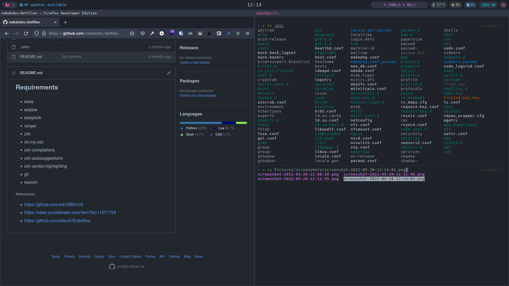
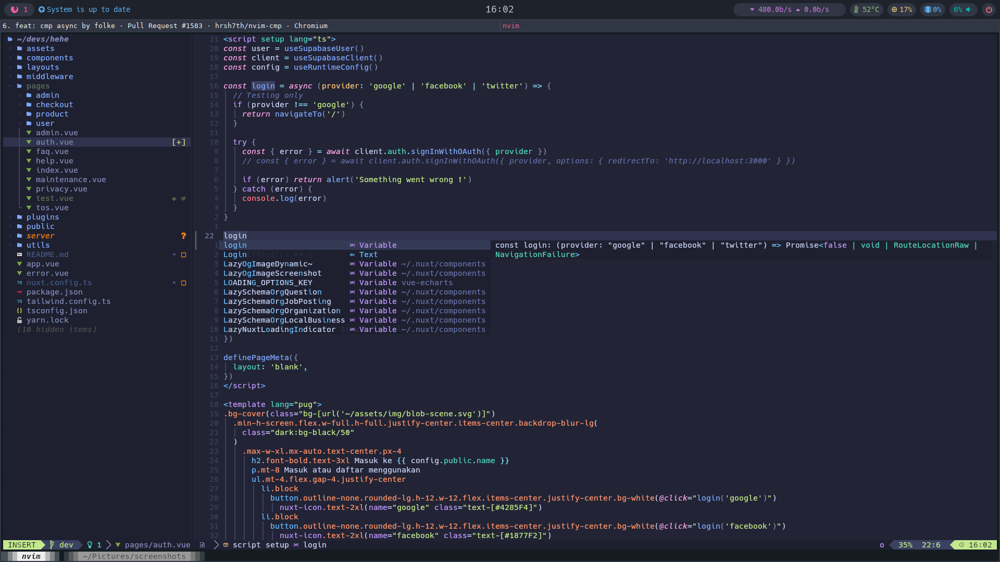

## Packages

| App                  | Package                                                 |
| :------------------- | :------------------------------------------------------ |
| Shell                | [Zsh (oh-my-zsh)](https://wiki.archlinux.org/title/Zsh) |
| WM / DE / Compositor | [Hyprland](https://hyprland.org/)                       |
| Status Bar           | [Waybar](https://github.com/Alexays/Waybar)             |
| Editor               | [Neovim](https://wiki.archlinux.org/title/Neovim)       |
| Terminal             | [Kitty](https://wiki.archlinux.org/title/Kitty)         |
| File Manager         | [Ranger](https://wiki.archlinux.org/title/Ranger)       |

# Packages

- [swaylock-effects](https://github.com/mortie/swaylock-effects) : fork of swaylock with fancy effects
- [Sweet](https://github.com/EliverLara/Sweet) : Light and dark colorful Gtk3.20+ theme
- [capitaine-cursors](https://github.com/keeferrourke/capitaine-cursors) : An x-cursor theme inspired by macOS and based on KDE Breeze.
- [wofi](https://sr.ht/~scoopta/wofi/) : launcher/menu for wlroots based wayland compositors

## USAGE

### Install packages

```bash
yay -Syu hyprland-git \
    waybar-hyprland-git \
    swaylock-effects \
    wlogout \
    wofi \
    capitaine-cursors \
    sweet-theme-git \
    xdg-desktop-portal-hyprland \
    iproute2 \
    wireless_tools \

```

```bash
git clone --depth 1 --separate-git-dir=$HOME/.dotfiles https://github.com/nabakdev/dotfiles.git $HOME/dotfiles-tmp
    rm -r ~/dotfiles-tmp/
    alias dotfile='/usr/bin/git --git-dir=$HOME/.dotfiles/ --work-tree=$HOME'
```

## Screenshots






###### Optionals shell command wrapper

- [bat](https://github.com/sharkdp/bat)
- [prettyping](https://github.com/denilsonsa/prettyping)
- [lazygit](https://github.com/jesseduffield/lazygit.git)
- [icons-in-terminal](https://github.com/sebastiencs/icons-in-terminal)

###### References

- https://news.ycombinator.com/item?id=11071754
- https://github.com/siduck76/dotfiles
